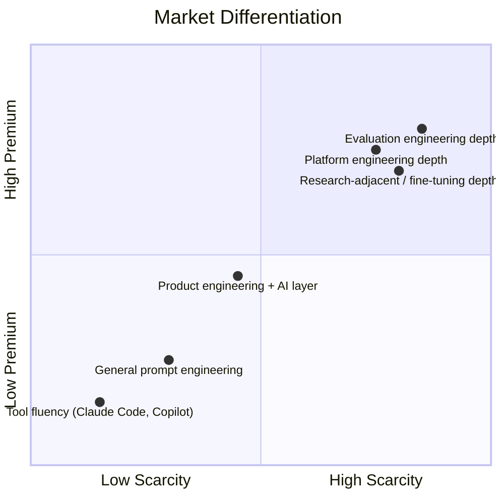

A caveat before anything else: this is a directional read on market dynamics, not a compensation report. I'm not going to state specific dollar figures as universal fact — pay varies enormously by company, stage, and region, and anyone treating a blog post's numbers as ground truth for their own negotiation is making a mistake regardless of which numbers I picked. What I can speak to with more confidence is the *shape* of the market shift, because it's visible in the same trend this blog has been tracking all year.

## The broad dynamic

December's [predictions post](/posts/ai-engineering-2027-predictions/) called this at high confidence: AI coding tools becoming table stakes rather than differentiators, because adoption was already near-universal among professional engineers by the end of 2026. That prediction is holding. "I use Claude Code" or "I use Copilot" is no longer a notable line on a resume or a differentiating answer in an interview — it's an assumed baseline, the same way "I use Git" stopped being worth mentioning a decade ago.

What's shifted as a result is where the compensation premium actually sits. It's moved off tool fluency — which is now broadly commoditized — and onto the kind of depth this whole career-growth series has been mapping: platform engineering, evaluation design, systems-level judgment about probabilistic components. That depth remains comparatively scarce, for the straightforward reason that it takes real production experience with things going wrong to build, and there hasn't been enough calendar time yet for the supply of engineers with that experience to catch up to demand.

## Why demand stays high despite maturing tooling

It would be reasonable to expect that as the tooling landscape matures — better frameworks, better managed platforms, more accessible fine-tuning per the December predictions — the skill bar for AI engineering would drop and demand would ease. That's not quite what's happening. The tooling maturing has lowered the barrier to *initial* AI capability — getting a first RAG feature or agent prototype working is meaningfully easier than it was two years ago. It hasn't lowered the barrier to *operating that capability reliably at scale*, which is a different and harder skill, and it's specifically the skill enterprises that spent 2025 and 2026 building initial AI capability now need in volume.

This is a familiar pattern from other infrastructure maturity curves: the tools that made it easy to spin up a first version of something didn't reduce demand for the engineers who know how to run it well in production — they shifted demand toward exactly those engineers, because now there are more systems in production that need that judgment applied to them.

## Practical guidance for engineers

Broad AI tool familiarity is no longer the differentiator it was in 2024 and 2025 — treat it as a baseline expectation, not a selling point. What differentiates now is demonstrable depth in one of the four tracks from [the career paths post](/posts/career-paths-ai-engineering-specializations/) earlier this week, backed by a concrete artifact rather than a claim on a resume:

- An open-source contribution to an eval framework or observability tool — something reviewable, not just described.
- A well-documented platform project, even an internal one, that you can talk through in specific technical detail: the tradeoffs, the failure modes you designed around, the numbers that justified the approach.
- A technical blog or writeup — this one included — that documents real production judgment, not tutorial-level content. The difference is visible immediately to anyone evaluating it: does this describe a decision made under real constraints, with real tradeoffs and an honest account of what didn't work, or does it read like a rehash of documentation.

Any of these does more for a candidate's market position than another line item about tool usage, because they're evidence of the specific thing the market is now pricing at a premium: judgment built from doing the work, not familiarity with doing the work.

## For hiring managers

This connects directly to [the hiring rubric post](/posts/hiring-ai-engineers-rubrics/) from earlier this week — the same shift shows up on the demand side of the market. Screening for the deeper signal (system design reasoning around non-deterministic components, trace debugging from real evidence, eval design judgment) rather than surface-level tool fluency isn't just good interview design, it's a response to where the actual scarcity in the market has moved. A rubric still built around "can you write a good prompt" is screening for a skill the market has already stopped paying a premium for, and it will keep passing candidates who look strong on that axis and struggle on the axes that matter once they're actually on the job.

The honest summary: the market rewarded broad tool adoption early because broad tool adoption was itself scarce. It isn't scarce anymore. What's scarce now is the judgment layer on top of the tools — and that layer takes real production time to build, which means it's going to stay a genuine differentiator for a while yet, regardless of how good the next generation of tooling gets.
