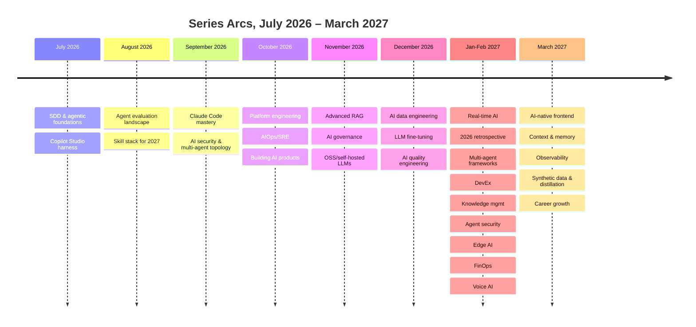

I started this blog in July 2026 with a post on agent containment and blast radius control, and I'm closing this particular stretch of it — a year and a bit later, and a week of posts about career growth and team leadership — with this one. In between there's something like nine months of near-daily posts, and enough series that I'd genuinely lose count if I tried to do it from memory. It seems worth doing what I've asked plenty of teams in these posts to do to their own work: stop, look back honestly, and say what held up and what I'd argue differently now.

## The throughline

If there's one idea that recurs across every single one of those series, regardless of which specific tool or framework was the nominal topic, it's this: treat AI components with the same engineering discipline as any other production system. Testing. Evals. Observability. Cost accountability. Security review. Not a special category exempt from rigor because it's probabilistic, not deterministic — a category that needs *more* deliberate rigor, precisely because it fails in ways that don't trip a traditional exception handler and don't show up in a stack trace.

Every arc — agent architecture, RAG, governance, self-hosting, fine-tuning, observability, and now career growth — was really the same argument applied to a different layer of the stack. Evals before ship, not after. Fallback design as part of the architecture, not a patch bolted on post-incident. Cost and reliability as first-class concerns from day one, not retrofits. If a reader only takes one thing from a year of this blog, I'd want it to be that the interesting engineering problem in AI systems was never "how do I get the model to do the thing" — it was "how do I build the scaffolding around the model so that when it doesn't do the thing, the system as a whole still behaves correctly." Career growth, it turns out, is downstream of the same idea: staff-level judgment, per this week's posts, is largely the ability to apply that discipline consistently and teach other people to do the same.

## What held up

The bets I made early paid off, and I say that with real relief because a year is a long time for AI tooling to move underneath you. Evals-first thinking held up completely — if anything, the case for it got stronger as the field matured, not weaker, because as tooling got more capable it also got easier to ship something that looked right without ever checking whether it actually was. Systems thinking over prompt tricks held up — the December antipatterns post naming "prompt engineering as the only optimization lever" as a mistake teams kept making was still true in March, and I'd bet it stays true through the rest of 2027. Human-in-the-loop before full autonomy held up — every reliable agent deployment I've seen or heard about earned its autonomy incrementally against real production evidence, not granted it up front because the demo looked good.

None of those were contrarian bets when I made them. They were just discipline applied consistently while a lot of the discourse around them was chasing whatever the newest framework or model release promised. Being unglamorous and being right turned out to be compatible.

## What I'd push back on

Reading my own early-2026 posts now, a few places make me wince a little, and I think it's worth naming that honestly rather than pretending the whole arc was foresight.

I was more optimistic about GraphRAG's general applicability early on than the hands-on experience across the RAG series later justified. The technique is genuinely valuable for the specific shape of problem it solves — multi-hop reasoning over richly connected entities — and I undersold, in earlier posts, how narrow that shape actually is in practice, and how much unnecessary complexity teams took on trying to apply it to problems that plain hybrid retrieval would have handled better and cheaper.

I was also more confident early on than experience later warranted about the maturity of some of the multi-agent frameworks covered in July and September. The demos were genuinely impressive. The production failure modes — error propagation across agent boundaries, the compounding failure probability of multi-step autonomous chains — took longer to surface and were uglier than the framework marketing suggested, and later posts in this blog's own multi-agent and reliability series ended up correcting the record more than I'd anticipated needing to when I wrote the earlier ones.

Neither of these were wrong in the sense of bad reasoning at the time — they were early confidence that had to be tempered by the thing that always tempers early confidence in this field: actually running it in production long enough to watch it fail in ways the demo never showed.

## Closing thought

If you've followed this blog through the whole arc — SDD through agent evaluation, Claude Code, security, multi-agent architecture, platform engineering, AIOps, product engineering, RAG, governance, self-hosting, data engineering, fine-tuning, quality engineering, real-time systems, the 2026 retrospective, developer experience, knowledge management, agent security, edge AI, FinOps, voice, frontend, memory, observability, synthetic data, and now career growth — thank you for sticking with something that was, by design, never going to be exciting in the AGI-headline sense. The specific tools in every one of these posts will keep changing, and some of them already have. Evals, observability, governance, and incremental autonomy as the earned default rather than the assumed one — those practices are the actual durable skill worth carrying forward, and they're not going to stop being the right answer just because the model generation underneath them changes again. That's been true for every layer of the stack this blog has covered, and I don't see a reason it stops being true for the layer this week's posts were about: your own career.
